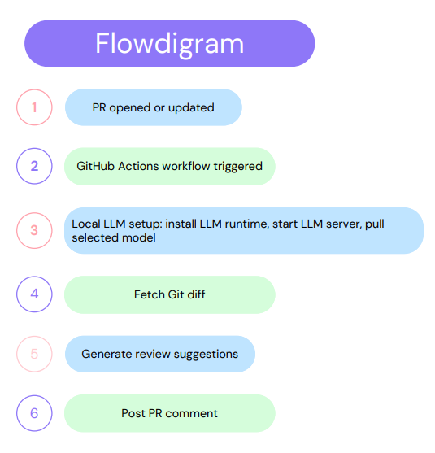
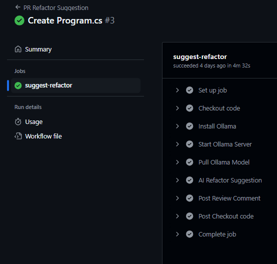
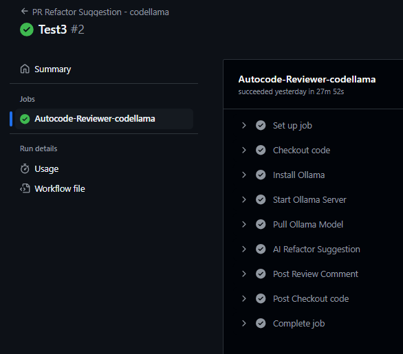
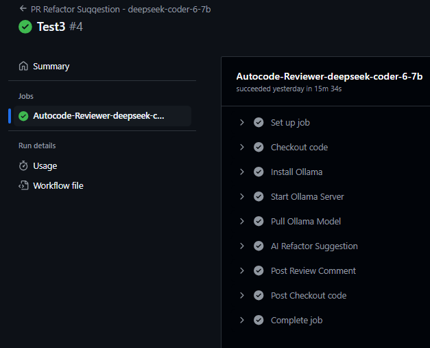

# Custom Auto Code Review Process for GitHub

## Part 1: Theoretical Evaluation of a Custom Auto Code Review Process for GitHub

### 1. The Problem and Opportunity Statement
- **Problem:**  
  While GitHub offers its own Copilot code review features, these are often premium, cloud‑based, and might not offer the fine‑grained control, privacy guarantees, or cost efficiency desired by all organizations. There may also be a desire to use specific open‑source models or custom‑tuned models not available through commercial services.  
- **Opportunity:**  
  Leverage the principles of the “zero‑cost” Azure DevOps Copilot (using local LLMs on CI/CD runners) to create an in‑house, customizable, and privacy‑enhanced automated code review solution for GitHub—without incurring direct AI service costs.

### 2. High-Level Architectural Flow (Conceptual)
1. **Trigger:** A Pull Request (PR) is opened or updated in a GitHub repository.  
2. **GitHub Actions Workflow Activation:** The PR event fires a dedicated GitHub Actions workflow.  
3. **Code Fetching:** The workflow fetches the relevant code changes (diff) or entire files from the PR.  
4. **Local LLM Setup:** On the GitHub Actions runner, a local LLM server (e.g., Ollama) is started, and a pre‑selected open‑source model is loaded.  
5. **Prompt Construction:** The fetched code, along with a tailored prompt for code review, is sent to the local LLM.  
6. **AI Analysis:** The local LLM processes the prompt and code, generating review suggestions.  
7. **Comment Generation:** The LLM’s response is formatted into a readable comment.  
8. **PR Comment Posting:** The workflow uses the GitHub API to post the generated comment directly onto the Pull Request.

### 3. Key Components and Theoretical Considerations

#### a. AI Companion (Local LLM Framework)
- **Options:**
  - **Ollama:** Easy setup, multi‑platform support, good model library.
  - **LM Studio / GPT4All / PrivateGPT:** Local LLM servers with simple APIs.
  - **Hugging Face Transformers (Python):** Granular control, supports custom tuning.
- **Pros:**
  - Cost‑efficient (no per‑token fees)
  - Privacy/Security (no code leaves runner)
  - Customization (choose/tune open‑source models)
  - Offline capability after model download
- **Cons:**
  - Resource intensive (RAM/CPU/GPU demands)
  - Model quality varies
  - Initial setup complexity
  - Slower inference vs. cloud APIs

#### b. Execution Environment (GitHub Actions Runners)
- **GitHub‑Hosted Runners**
  - **Pros:** Zero infra cost, fully managed, easy to configure.
  - **Cons:** Limited CPU (2 cores), RAM (7 GB), SSD (14 GB), no GPUs, time/usage limits.
- **Self‑Hosted Runners**
  - **Pros:** Provision powerful hardware (GPUs, RAM), full control, faster inference.
  - **Cons:** Infrastructure cost, management overhead, more complex setup.

#### c. Integration Layer (GitHub Actions Workflow)
- **Mechanism:** YAML workflow definition
- **Key Aspects:**
  - **Triggering:**  
    ```yaml
    on:
      pull_request:
        types: [opened, reopened, synchronize]
    ```
  - **Code Access:** `actions/checkout`, then `git diff` or file reads
  - **LLM Communication:** Shell scripts (Bash/PowerShell) calling local API endpoints
  - **GitHub API:** `actions/github-script` or Octokit to post comments (requires `GITHUB_TOKEN`)

### 4. Key Theoretical Trade‑offs and Decisions
- **Native Copilot vs. Custom Solution:**  
  Ease‑of‑use vs. control/cost/privacy  
- **Model Size vs. Quality:**  
  Smaller models run on limited hardware but deliver lower‑quality reviews; larger models need better runners.  
- **Runner Type:**  
  Hosted (zero cost) vs. self‑hosted (higher performance, infrastructure cost)  
- **Review Granularity:**  
  Whole‑file summaries vs. line‑by‑line comments  
- **Prompt Engineering Strategy:**  
  Critical for output quality; must craft prompts that yield actionable feedback.

### 5. Non‑Functional Requirements & Constraints (Theoretical)
- **Cost:** Target “zero” direct AI costs  
- **Performance:** Complete reviews in 5–10 minutes (max.)  
- **Accuracy:** Aim for ≥ 70 % useful suggestions  
- **Privacy:** No code sent externally  
- **Maintainability:** Easy updates to models, prompts, workflows  
- **Scalability:** Handle concurrent PRs within runner limits

### 6. Risks (Theoretical)
- **Hallucinations:** Incorrect or irrelevant suggestions  
- **Resource Exhaustion:** Exceeding runner capacity  
- **Model Obsolescence:** Rapid evolution of open‑source models  
- **Integration Fragility:** Breaking changes in Actions, APIs, or LLM tools  
- **Developer Fatigue:** Ignored comments if feedback is poor  
- **Security Vulnerabilities:** Trust in model origins and biases

---


## High‑Level Architectural Flow



*Figure: Automated PR review process, from PR open to comment posting.*

---

## Example: PR Refactor Suggestion Workflow & PowerShell Script

### File: `.github/workflows/pr_review.yml`
```yaml
name: PR Refactor Suggestion

on:
  pull_request:
    types: [opened, reopened, synchronize]
    paths-ignore:
      - '.github/workflows/**'
      - 'scripts/**'
      - 'README.md'
      - 'docs/**'
      - '*.md'

jobs:
  suggest-refactor:
    runs-on: ubuntu-latest
    timeout-minutes: 30

    permissions:
      contents: read
      pull-requests: write

    env:
      OLLAMA_MODEL: qwen2.5-coder
      OLLAMA_HOSTNAME: http://localhost:11434

    steps:
      - name: Checkout code
        uses: actions/checkout@v4
        with:
          fetch-depth: 0

      # --- Ollama Setup Steps ---
      - name: Install Ollama
        run: |
          curl -fsSL https://ollama.com/install.sh | sh
        shell: bash

      - name: Start Ollama Server
        run: |
          echo "Killing any existing Ollama serve processes…"
          pkill -f "ollama serve" || true
          lsof -ti :11434 | xargs --no-run-if-empty kill -9 || true

          echo "Starting Ollama server in detached mode…"
          if ! curl --silent --head --fail http://localhost:11434; then
            nohup ollama serve > /dev/null 2>&1 &
            disown
          else
            echo "→ Ollama already running!"
          fi

          echo "Waiting up to 30s for Ollama to respond…"
          for i in $(seq 1 30); do
            if curl --silent --head --fail http://localhost:11434; then
              echo "→ Ollama is up!"
              exit 0
            fi
            echo "  attempt $i…"
            sleep 1
          done

          echo "Ollama did not start."
          exit 1
        shell: bash

      - name: Pull Ollama Model
        run: |
          ollama pull ${{ env.OLLAMA_MODEL }}
        shell: bash

      - name: AI Refactor Suggestion
        id: ai_review_step
        shell: pwsh
        run: |
          $suggestion = & ./scripts/GenAISuggestion.ps1

          if ($suggestion -and $suggestion.Trim() -ne "" -and $suggestion -ne "No review comment generated.") {
            $suggestion | Out-File -FilePath "./ai_suggestion.txt" -Encoding utf8
            Write-Output "HAS_AI_COMMENT=true" >> $env:GITHUB_ENV
            Write-Output "AI suggestion saved to file"
          } else {
            Write-Output "HAS_AI_COMMENT=false" >> $env:GITHUB_ENV
            Write-Output "No valid AI suggestion generated"
          }

      - name: Post Review Comment
        if: env.HAS_AI_COMMENT == 'true'
        uses: actions/github-script@v7
        with:
          github-token: ${{ secrets.GITHUB_TOKEN }}
          script: |
            const fs = require('fs');
            const comment = fs.readFileSync('./ai_suggestion.txt', 'utf8');
            const commentBody = `## AI Code Review Suggestions

> **Powered by Ollama (${{ env.OLLAMA_MODEL }})**

${comment}

---
*This review was automatically generated. Please use your judgment when applying these suggestions.*`;

            await github.rest.pulls.createReview({
              owner: context.repo.owner,
              repo: context.repo.repo,
              pull_number: context.issue.number,
              event: 'COMMENT',
              body: commentBody
            });
            console.log('AI review comment posted successfully');
```

### File: `scripts/Get_AICodeReview.ps1`
```ps1

<#
.SYNOPSIS
  Fetches the current PR diff and asks Ollama for refactoring advice.
  Prints the suggestion to stdout.
#>

function Invoke-OllamaApi {
    [CmdletBinding()]
    param (
        [Parameter(Mandatory)][string] $Model,
        [Parameter(Mandatory)][string] $Prompt,
        [string] $HostName = 'http://localhost:11434'
    )
    $body = @{ model = $Model; prompt = $Prompt; stream = $false } | ConvertTo-Json

    try {
        $response = Invoke-RestMethod -Method POST `
          -Uri "$HostName/api/generate" `
          -Body $body -ContentType 'application/json'
        return $response.response
    } catch {
        Write-Error "Ollama API call failed: $_"
        return $null
    }
}

# Main
git fetch origin $Env:GITHUB_BASE_REF
$diff = git diff "origin/$($Env:GITHUB_BASE_REF)" $Env:GITHUB_SHA

if ([string]::IsNullOrWhiteSpace($diff)) {
    exit 0
}

$prompt = @"
You are a senior software engineer performing a pull request code review.
1. Identify only the **most critical issues** (bugs, missing logic, bad practices).
2. Ignore minor style or formatting issues.
3. For each issue, respond as a JSON object with:
   - **file**: filename
   - **line**: line number
   - **issue**: short but clear description
   - **impact**: High, Medium, or Low
   - **suggestion**: precise developer action

Respond with a **JSON array only**.

--- Git diff ---
$diff
"@

$suggestion = Invoke-OllamaApi -Model $Env:OLLAMA_MODEL -Prompt $prompt -HostName $Env:OLLAMA_HOSTNAME

if (-not [string]::IsNullOrWhiteSpace($suggestion)) {
    Write-Output $suggestion.Trim()
}

```


## 4. Sample Workflow Run & AI Review Output

**Push Event:** `Program.cs` created under `images/`  
**Commit Message:** “Represents a simple Product entity. Add Business logic for managing Products”

---

### GitHub PR Context

```text
Create Program.cs #17
Closed
chirag-memariya wants to merge 1 commit into main from test
+149 −0 

Commits: 1 Checks: 6 Files changed: 1

Conversation:
  chirag-memariya commented 4 days ago
  “Represents a simple Product entity. Add Business logic for managing Products”
```

### AI Review - #1 : `phi3`
```json
[
  {
    "file": "Program.cs",
    "line": null,
    "impact": "High",
    "issue": "Bug introduced in the `UpdateProduct` method that skips updating a property.",
    "suggestion": "Correctly update all necessary properties within the if statement."
  },
  {
    "file": "Program.cs",
    "line": null,
    "impact": "Medium",
    "issue": "Potential for NullReferenceException in `DeleteProduct` method due to early exit.",
    "suggestion": "Return false immediately if the product is already deleted."
  },
  {
    "file": null,
    "line": null,
    "impact": "None",
    "issue": null,
    "suggestion": null
  }
]
```

### AI Review #2 (qwen2.5-coder)
```json
[
  {
    "file": "Program.cs",
    "line": 78,
    "impact": "High",
    "issue": "The `UpdateProduct` method does not update the `StockQuantity` property, which can lead to incorrect stock levels if it's intended to be updated.",
    "suggestion": "Add a line to update the `StockQuantity` property in the `UpdateProduct` method."
  },
  {
    "file": "Program.cs",
    "line": 32,
    "impact": "Medium",
    "issue": "The `_nextId` field is not thread-safe and could lead to issues if this class is used by multiple threads simultaneously.",
    "suggestion": "Consider using a thread-safe counter or lock mechanism."
  },
  {
    "file": "Program.cs",
    "line": 47,
    "impact": "Low",
    "issue": "The `AddProduct` method outputs a message to the console, which might not be desirable in a production environment.",
    "suggestion": "Consider using logging instead of console output for informational messages."
  },
  {
    "file": "Program.cs",
    "line": 124,
    "impact": "Low",
    "issue": "The `ReduceStock` method outputs a message to the console, which might not be desirable in a production environment.",
    "suggestion": "Consider using logging instead of console output for informational messages."
  },
  {
    "file": "Program.cs",
    "line": 143,
    "impact": "Low",
    "issue": "The `GetProductById`, `GetAllProducts`, and `DeleteProduct` methods output messages to the console, which might not be desirable in a production environment.",
    "suggestion": "Consider using logging instead of console output for informational messages."
  }
]
```

### AI Review #3 (codegemma)
```json
[
  {
    "file": "Program.cs",
    "line": 44,
    "impact": "High",
    "issue": "Missing property update",
    "suggestion": "Update the missing property 'StockQuantity' in the `UpdateProduct()` method."
  },
  {
    "file": "Program.cs",
    "line": 132,
    "impact": "Medium",
    "issue": "Insufficient stock check",
    "suggestion": "Implement additional logic to check for sufficient stock before reducing it."
  },
  {
    "file": "Program.cs",
    "line": 144,
    "impact": "Low",
    "issue": "Console logging",
    "suggestion": "Consider using a logging framework for structured logging instead of direct console output."
  }
]
```


### AI Review #4 (codellama)
**Analyzing the git diff, codellama reports:**

1. **Missing properties in update method**  
   - **Impact:** High  
   - **Issue:** `UpdateProduct` only updates `Name`, not `Price`.  
   - **Suggestion:** Also update `Price` within the update logic.

2. **Incorrect stock reduction**  
   - **Impact:** High  
   - **Issue:** `ReduceStock` doesn’t check if product exists before reducing.  
   - **Suggestion:** Validate existence before decrementing stock.

3. **Incorrect deletion**  
   - **Impact:** High  
   - **Issue:** `DeleteProduct` doesn’t verify product existence.  
   - **Suggestion:** Check and handle non‑existent products gracefully.

4. **Lack of input validation**  
   - **Impact:** High  
   - **Issue:** Methods like `AddProduct` don’t validate inputs.  
   - **Suggestion:** Add null/empty checks for required parameters.

5. **Lack of logging**  
   - **Impact:** Medium  
   - **Issue:** Uses `Console.WriteLine` for output.  
   - **Suggestion:** Integrate a logging framework (e.g., Serilog).

### AI Review #5 (deepseek-coder:6.7b)
```json
[
  {
    "file": "Program.cs",
    "line": 1,
    "impact": "High",
    "issue": "Filename does not represent the content of the file.",
    "suggestion": "Ensure filename corresponds to its content."
  },
  {
    "file": "ProductService.cs",
    "line": 187,
    "impact": "Medium",
    "issue": "Null checks are missing for arguments.",
    "suggestion": "Implement strict null checks in the methods."
  },
  {
    "file": "ProductService.cs",
    "line": 247,
    "impact": "Medium",
    "issue": "Console output used for debugging.",
    "suggestion": "Replace console logging with proper logging framework."
  },
  {
    "file": "ProductService.cs",
    "line": 234,
    "impact": "High",
    "issue": "Missing property update during product update.",
    "suggestion": "Complete the update operation for all properties."
  },
  {
    "file": "ProductService.cs",
    "line": 16,
    "impact": "High",
    "issue": "In-memory list used for storing products.",
    "suggestion": "Switch to a more scalable and performant data storage."
  }
]
```

## Final Output

**deepseek-coder-v2:16b** – Good Performance!

This model provided several relevant suggestions:

1. **Caught the intentional bug!**  
   It states:  
   > “Missing properties: In the Product class during update operation, it's missing updating of `StockQuantity`. This could lead to inconsistency if not handled properly.”  
   **Suggestion:** “Complete the update operation for all properties.”

2. **Potential null reference in AddProduct method when product is null**  
   This is technically accurate; while you have a `throw new ArgumentNullException`, the model correctly points out the potential if that check weren’t there or if `product` somehow became null later.

3. **Empty string check in AddProduct method is overly simplistic**  
   This refers to `string.IsNullOrWhiteSpace`. While `IsNullOrWhiteSpace` does check for whitespace, the model might be suggesting a more robust validation framework or custom rules beyond basic string checks. It’s a valid point for stricter validation.

4. **Potential null reference in GetProductById method**  
   This is less critical; `FirstOrDefault` correctly returns `null` if not found, and `_products` itself is initialized in the constructor. This might be a slight over-alert.

5. **“Update logic does not update the product if it does not exist in the list” and “Delete logic does not delete the product if it does not exist in the list”**  
   This is a misinterpretation. The methods correctly return `false` if the product isn’t found, which is standard practice for update/delete operations in a service layer where existence isn’t guaranteed. It’s not a bug.

6. **Insufficient stock check in ReduceStock method is overly simplistic**  
   Similar to the Name check, it’s suggesting more robust validation for the `quantity` parameter.


## Public vs Private Repo Performance

- **Public repo runner**  
  - 4 cores, 16 GB RAM  
  - Can run **deepseek-coder-v2:16b** in **4 m 30 s** per workflow (e.g. adding `ProductService.cs`).

- **Private repo runner**  
  - 2 cores, 7 GB RAM  
  - Can run **deepseek-coder:6.7b** in **15 minutes** per workflow  
  - Can run **codellama:7b** in **27 m 52 s** (e.g. reviewing an ASP .NET Web API PR for `WeatherBroadcast`).

.

.  
*Figure: Automated PR review using deepseek-coder-v2:16b*.
.

.  
*Figure: Automated PR review using codellama:7b*.
.

.  
*Figure: Automated PR review using deepseek-coder:6.7b*

.
---

- **GitHub Actions free tier limits:**  
  - **2,000 minutes** of CI/CD runtime per month  
  - **500 MB** of storage for artifacts/cache per month


## PoC Final Outcome: Infrastructure Requirements for Private Repos

### 1. Free‑Tier GitHub‑Hosted Runners — Not Viable for 8B‑Parameter Models
- **Resources:** 2 CPU cores, 7 GB RAM, no GPU  
- **Performance:**  
  - deepseek-coder:6.7b → ~15–20 min per PR  
  - codellama:7b → ~28 min per PR  
- **Usage Limits:**  
  - 2,000 CI minutes/month → exhausted by a handful of reviews  
  - 500 MB storage/month → quickly filled by model artifacts  

> **Conclusion:** Long runtimes + limited monthly minutes make free‑tier runners impractical for frequent, high‑quality AI reviews.

---

### 2. Recommended: Self‑Hosted Runner for Private Repos
Deploy a dedicated machine as a GitHub self‑hosted runner with at least:

| Component     | Minimum Specification              |
|---------------|------------------------------------|
| **CPU**       | Intel Core i7 (≥ 6 cores)          |
| **GPU**       | NVIDIA GTX 1660 Ti (≥ 8 GB VRAM)   |
| **RAM**       | 16 GB+                             |
| **Storage**   | 100 GB+ SSD                        |

#### Benefits
- **Unlimited CI Capacity:** No monthly minute caps.
- **Faster Reviews:**  
  - 8B‑parameter models (e.g., deepseek‑coder‑v2:7b) complete reviews in ≲ 5 min.  
  - Matches or exceeds public‑runner performance (4 m 30 s on 4 core/16 GB).
- **Scalability:** Supports concurrent PR reviews without queue delays.
- **Cost Control:** Avoids per‑token API fees and extra cloud CI charges.

---

