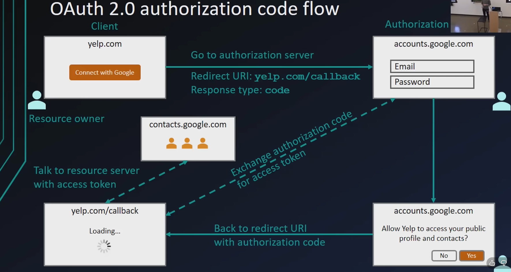
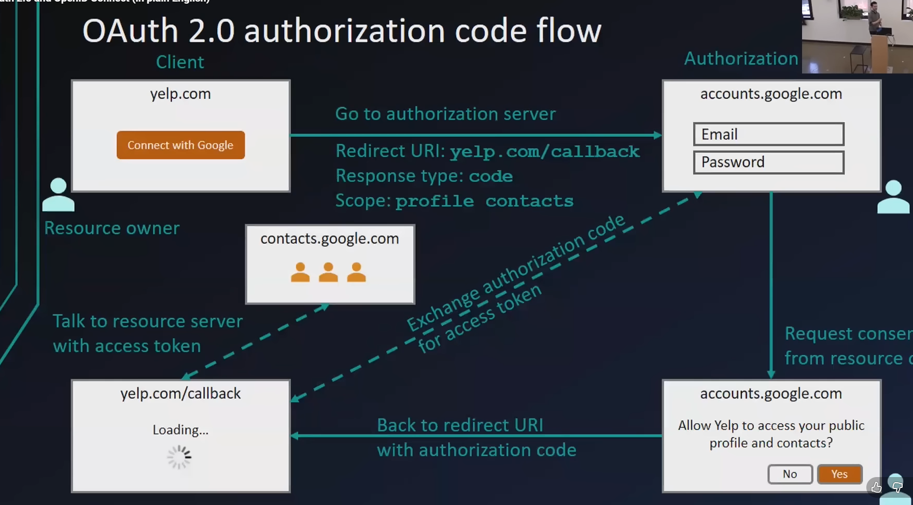

### OAuth2.0 terminology
- scope
- policy

Question
- why do we have tow things why do we have to get an authorization code and then exchange that for the access token , why dont we just use the code or why dont we get the 
    access token immediately? why is there that extra step?(why we need to do this extra step, why we get a code instead of just getting the token right away?)
Answer
- 
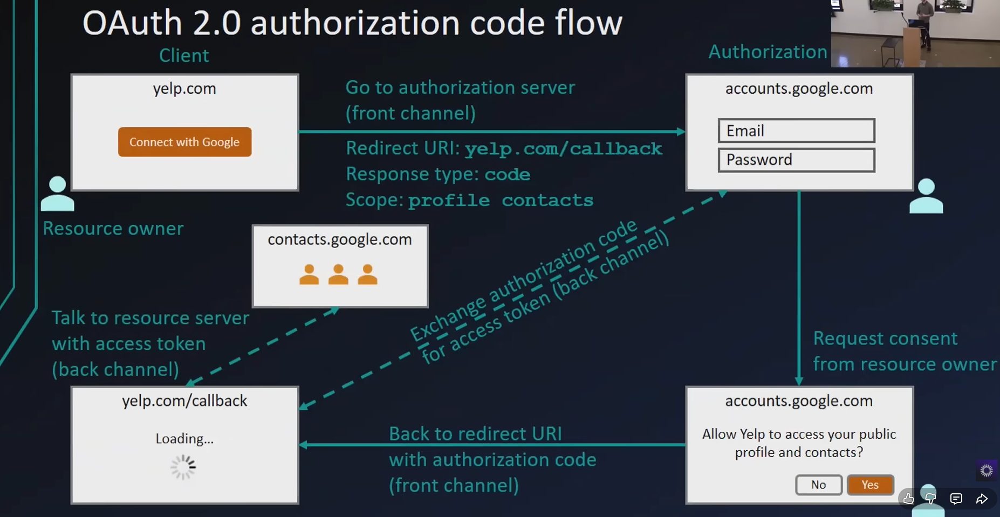

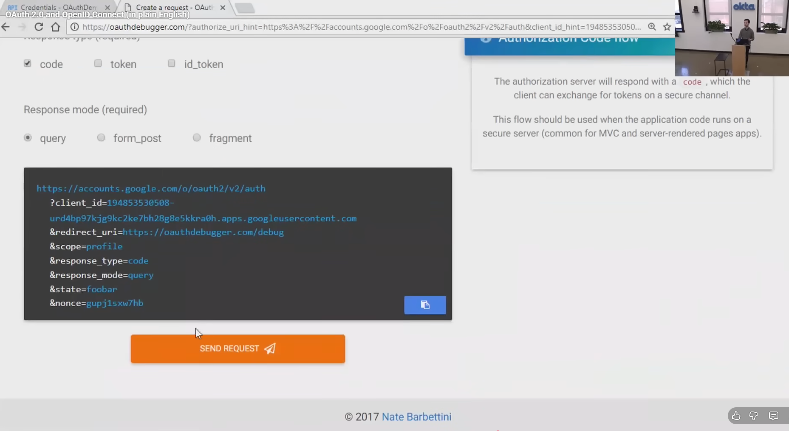 - for testing auth 

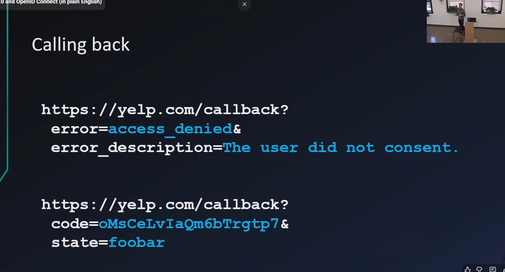

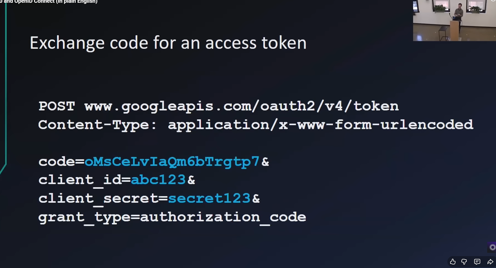
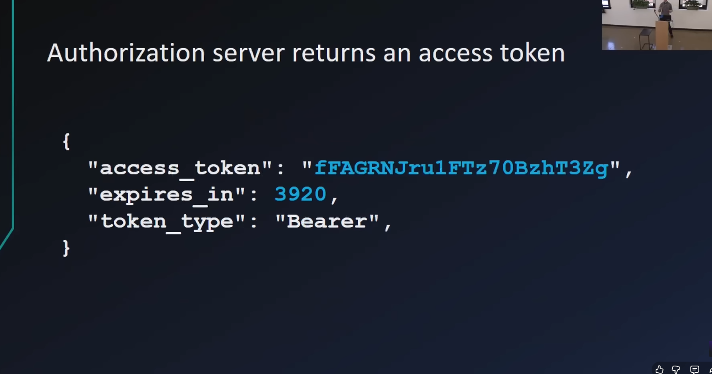
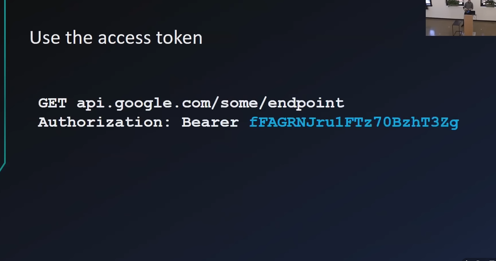
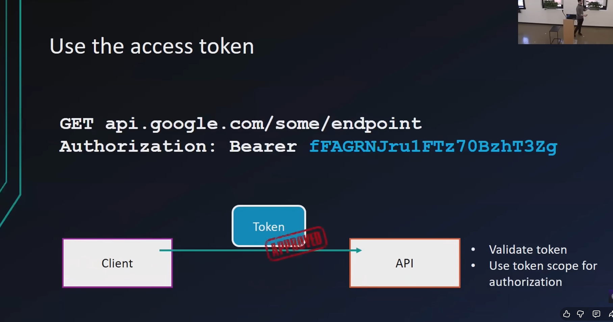

### implicit flow(fronted only)
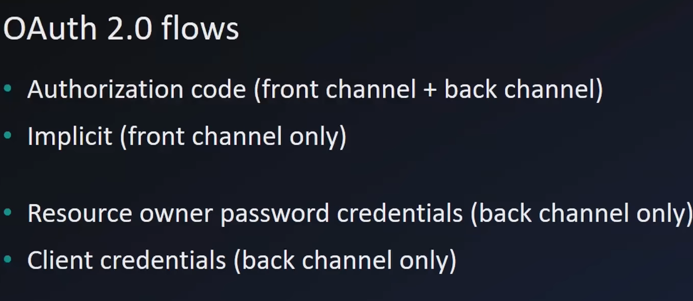
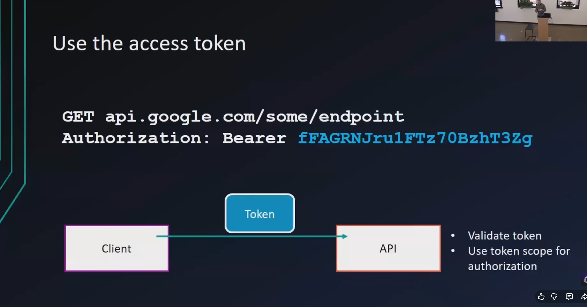

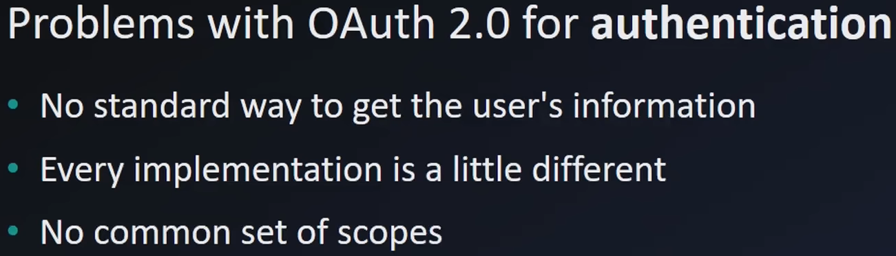
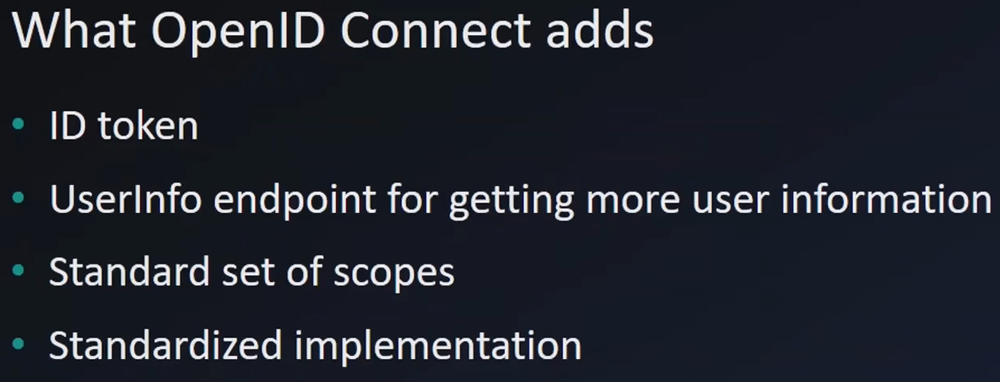
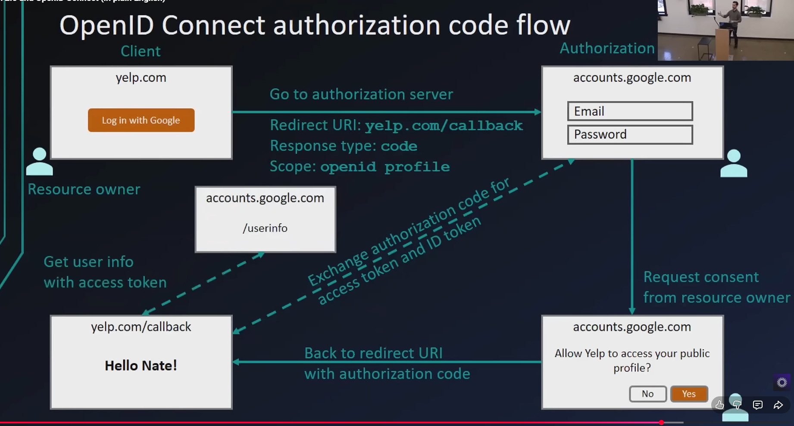 - get user info with access token

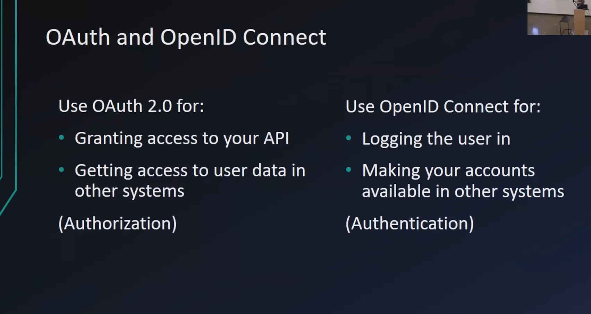
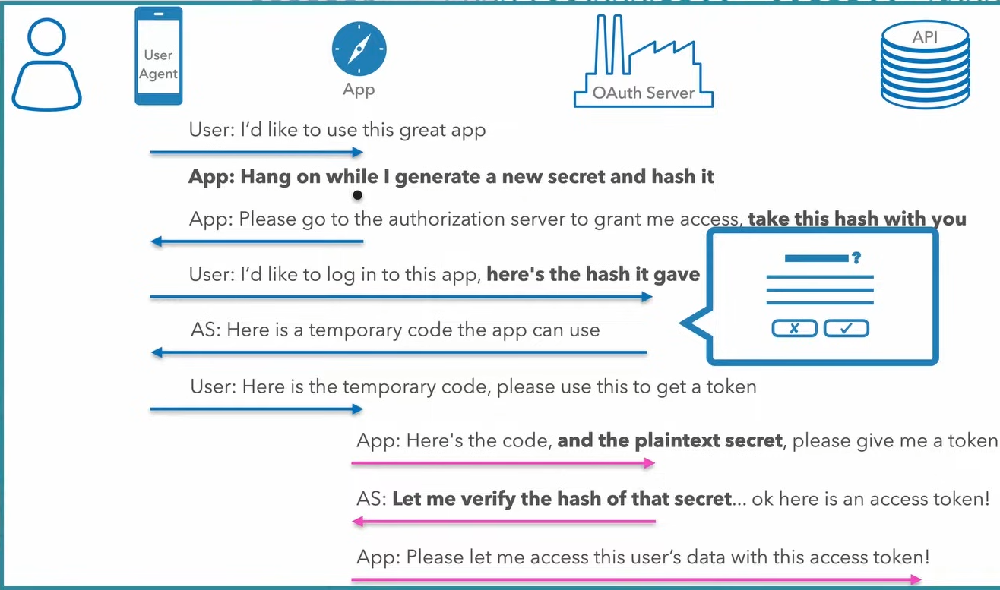